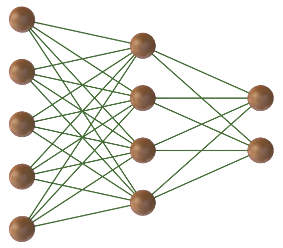
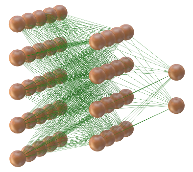
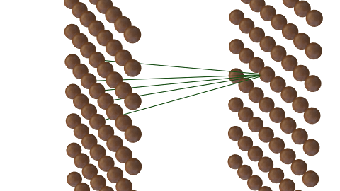
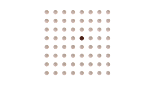
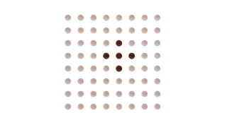
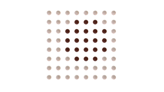

Neural2d - Neural Net Simulator
================================

User Manual
===========

Ver. 1.0

Features
--------

*     Optimized for 2D image data -- input data is read from .bmp image files
*     Neuron layers can be abstracted as 1D or 2D arrangements of neurons
*     Network topology is defined in a text file
*     Neurons in layers can be fully or sparsely connected
*     Selectable transfer function per layer
*     Adjustable or automatic training rate (eta)
*     Optional momentum (alpha) and regularization (lambda)
*     Standalone console program
*     Heavily-commented code, < 2000 lines, suitable for prototyping and experimentation
*     Optional GUI controller
*     Tutorial video coming soon!

Document Contents
-----------------

Requirements

Quick demo

How to use your own data

The 2D in neural2d

Topology config file format

Licenses

Requirements
------------

* C++-11 compiler  
* g++

* The optional GUI requires Python 3.x, and QT4 (Linux) or pyQt4 (Windows).

Quick demo
-----------

Place all the files, maintaining the relative directory structure, into a convenient directory.

In the images/digits/ subdirectory, extract the image files from the archive into the same directory.

To compile neural2d, cd to the directory containing the Makefile and execute:

    make

This will use g++ to compile neural2d.cpp and neural2d-core.cpp and result in an executable
named neural2d.

To run the GUI controller, execute:

    neuron2d-gui.py

If you get an error complaining about the python interpreter, it's because line 1 of neuron2d-gui.py
contains the wrong path to your Python 3 interpreter. Either change line 1 or else run it by
invoking the python interpreter directly, as in:

    python neuron2d-gui.py

or:

    python3 neuron2d-gui.py

A GUI interface will appear that looks like:

Press Start Net to launch the neural2d program. You'll see a separate window appear that looks something like this:

The neural net is initialized at this point, and paused waiting for your command to resume.

At this point, the default input data, or "training set", consists of a few thousand images of numeric digits, like these:

The images are 32x32 pixels each, stored in .bmp format. The neural net is configured
(by the default topology.txt file) to have 32x32 input neurons, and 10 output neurons. 
The net will be trained to classify the
digits in the images and to indicate the answer by driving the corresponding output neuron to
a high level.

Press Resume to start the neural net training. It will automatically pause when the
average error rate falls below a certain threshold. You now have a trained net.

How to use your own data
------------------------

First, prepare your set of input images. They need to be in .bmp format, and all must have
the same dimensions. Then prepare an input data config file, by default named "inputData.txt".
It contains a list of the
input image filenames and the expected output values of the neural net's output neurons.
A typical file contains lines like these:

    images/thumbnails/test-918.bmp -1 1 -1 -1 -1 -1 -1 -1 -1 -1
    images/thumbnails/test-919.bmp -1 -1 -1 -1 -1 -1 -1 -1 1 -1
    images/thumbnails/test-920.bmp -1 -1 -1 -1 -1 -1 1 -1 -1 -1
    images/thumbnails/test-921.bmp -1 -1 -1 -1 -1 1 -1 -1 -1 -1

Then prepare the network topology config file, by default named "topology.txt." It contains
lines that specify the number of layers, the number and arrangement of neurons in each layer,
and the way the neurons are connected. A complete description of the format can be found
in a later section. A typical topology config file looks something like this:

    input size 32x32  
    layer1 size 32x32 from input radius 8x8  
    layer2 size 16x16 from layer1  
    output size 1x10 from layer2  

Then run neuron2d-gui and experiment with the parameters until the net is adequately trained, then save
the weights in a file for later use.

Or execute the console program directly, specifying the topology, input data, and weights filenames, like this:

    neuron2d topology.txt inputData.txt weights.txt

If you run the GUI program, you can change the network parameters from the GUI. If you run the
neural2d console program directly, there is no way to interact with it while running.
Instead, you'll need to examine and modify the parameters in the code at the top of
the files neural-net.cpp and neural-net-test.cpp.

The 2D in neural2d
------------------

In a simple neural net model, the neurons are arranged in a column in each layer:

In neural2d, you can specify a rectangular arrangement of neurons in each layer, such as:

The neurons can be sparsely connected to mimic how retinal neurons are connected in biological brains.
For example, if the radius is "1x1", each neuron on the right (destination) layer will connect to a circular patch
of neurons in the left (source) layer as shown here (only a single neuron on the right side is shown connected
in this picture so you can see what's going on, but imagine all of them connected in the same pattern):

The pattern that is projected onto the source layer can be elliptical. Here are some projected
connection patterns for various radii:

radius 0x0   

radius 1x1   

radius 2x2   

radius 3x1   

Topology config file format
---------------------------

The topology config file contains lines of the following format:

> *layer-definition-line* := *layer-name* size *size-spec* [from *layer-name*] [radius *size-spec*] [tf *transfer-function*]

where

 > *layer-name* := "input", "output", or a string that begins with "layer"
    
 > *size-spec* := *integer* ["x" *integer*]
    
 > *transfer-function* := "tanh", "logistic", "linear", "ramp", or "gaussian"

Rules:

1. Comment lines that begin with "#" and blank lines are ignored.

1. The first layer defined must be named "input".

1. The last layer defined must be named "output".

1. The hidden layers can be named anything beginning with "layer".

1. The argument for "from" must be a layer already defined.

1. The same layer name can be defined multiple times with different "from" parameters.
This allows source neurons from more than one layer to be combined in one 
destination layer. The source layers can be any size.
When a destination layer is defined more than once, each line must have 
an identical size parameter. In the following example, layerCombined appears twice
with the same size:

     input size 128x128  
     layerVertical size 32x32 from input radius 1x8  
     layerHorizontal size 16x16 from input radius 8x1  
     **layerCombined** size **8x8** from layerVertical   
     **layerCombined**  size **8x8** from layerHorizontal  
     output size 1 from layerCombined  

1. The *size-spec* can specify two dimensions, or one. Spaces are not allowed in the size spec. 
If only one dimension is given, the other is assumed to be 1. For example:

 * "8x8" means 64 neurons in an 8 x 8 arrangement.  
 * "8x1" means a row of 8 neurons
 * "1x8" means a column of 8 neurons.  
 * "8" means the same as "8x1"  

Topology Config File Examples

Here are a few complete topology config files and the nets they specify.

    input size 4x4
    layer1 size 3x3 from input
    layer2 size 2x2 from layer1
    output size 1 from layer2

    input size 4x4
    layer1 size 1x4 from input
    layer2 size 3x1 from layer1
    output size 1 from layer2

    input size 4x4
    output size 4x1 from input radius 0x2

    input size 16x16
    layer1 size 4x4 from input radius 1x1
    output size 7x1 from layer1

    # In the picture that follows, layerVertical is the set of 4 neurons
    # in the upper part of the picture, and layerHorizontal is the lower
    # set of 4 neurons.
    
    input size 6x6
    layerHorizontal size 2x2 from input radius 2x0
    layerVertical size 2x2 from input radius 0x2
    output size 1 from layerHorizontal
    output size 1 from layerVertical

Licenses
--------

The neural2d program and its documentation are copyrighted and licensed under the terms of the MIT license.

The set of digits images in the images/digits/ subdirectory are released to the public domain.

